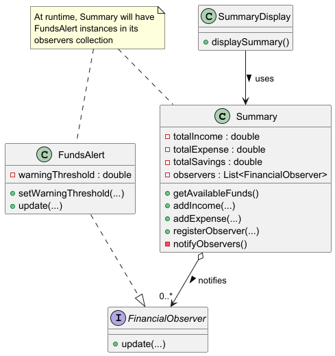

# Developer Guide

## Acknowledgements

{list here sources of all reused/adapted ideas, code, documentation, and third-party libraries -- include links to the original source as well}

## Design & implementation

### Summary Component

The Summary component is the core financial model of the application that maintains all financial data and provides methods to manipulate and retrieve this information.

#### API: Summary.java

Here's the class diagram of the Summary component:



How the Summary component works:

1. The `Summary` class maintains running totals of income, expenses, and savings.
2. It provides methods to add and remove financial entries (income, expenses, savings).
3. When financial data changes, the `Summary` notifies registered observers using the Observer pattern.
4. Validation is performed to ensure data integrity (e.g., preventing negative balances).

The Summary class implements the Observer pattern to notify other components when financial data changes:

```java
// In Summary.java
private List<FinancialObserver> observers = new ArrayList<>();

public void registerObserver(FinancialObserver observer) {
    observers.add(observer);
}

private void notifyObservers() {
    for (FinancialObserver observer : observers) {
        observer.update(getAvailableFunds(), totalIncome, totalExpense, totalSavings);
    }
}
```

Why it's implemented this way:
* The Observer pattern allows loose coupling between the financial data model and components that need to respond to financial changes (like alerts).
* Validation within each method ensures the application maintains a consistent financial state.

Alternatives considered:
* Direct method calls to alert components when financial data changes, but this would create tight coupling.
* Storing transaction history instead of running totals, but this would require more computation for each summary view.

### Summary Display Component

The SummaryDisplay component formats and presents financial data to the user in a readable format.

#### API: SummaryDisplay.java

The sequence diagram below shows how the `view summary` command is processed:


How the SummaryDisplay component works:

1. The `SummaryDisplay` is initialized with a reference to the `Summary` object.
2. When the user enters `view summary`, the command is processed by Duke and forwarded to `SummaryDisplay.displaySummary()`.
3. `SummaryDisplay` retrieves all necessary financial data from the `Summary` object.
4. The data is formatted into a readable text block and displayed to the user.

Why it's implemented this way:
* Separating display logic from data management follows the Single Responsibility Principle.
* The component depends only on the public interface of `Summary`, making it resilient to internal changes in the data model.

### Help Display Component

The HelpDisplay component provides users with information about available commands and their usage.

#### API: HelpDisplay.java

How the HelpDisplay component works:

1. The `HelpDisplay` class is a simple component that formats and displays help information.
2. When the user enters `help`, Duke calls `helpDisplay.displayHelp()`.
3. The component outputs a formatted list of commands and their usage.

Why it's implemented this way:
* Centralizing help text in one component makes it easier to maintain and update as commands change.
* The straightforward approach prioritizes clarity and maintainability over complexity.

### Funds Alert Component

The FundsAlert component implements a warning system that alerts users when their available balance falls below a set threshold.

#### API: FundsAlert.java, FinancialObserver.java

The sequence diagram below shows what happens when a user sets an alert threshold:


The sequence diagram below shows what happens when an alert is triggered:


How the FundsAlert component works:

1. `FundsAlert` implements the `FinancialObserver` interface to receive updates from the `Summary` component.
2. It maintains a warning threshold (default $5.00) that can be customized by the user.
3. When financial data changes, the `Summary` component calls the `update()` method of all registered observers.
4. `FundsAlert` checks if available funds are below the threshold and displays a warning if necessary.

Setting an alert threshold:
1. When the user enters `alert set 20`, the command is parsed by `AlertParser`.
2. An `AlertCommand` is created and executed.
3. The command calls `fundsAlert.setWarningThreshold(20.0)` to update the threshold.

Triggering an alert:
1. When the user adds an expense that reduces available funds below the threshold, `Summary` updates its data.
2. `Summary` notifies all observers, including `FundsAlert`.
3. `FundsAlert` compares available funds to the threshold and displays a warning if funds are too low.

Why it's implemented this way:
* The Observer pattern allows FundsAlert to be notified of financial changes without tight coupling to Summary.
* This design follows the Open/Closed Principle, making it easy to add new types of financial observers without modifying Summary.

Alternatives considered:
* Checking funds after each transaction in Duke.java, but this would scatter alert logic throughout the codebase.
* A polling approach where alerts check the summary periodically, but this would be less efficient and responsive.

## User Stories

|Version| As a ... | I want to ... | So that I can ...|
|--------|----------|---------------|------------------|
|v1.0|new user|see usage instructions|refer to them when I forget how to use the application|
|v1.0|user|be able to navigate through the CLI|efficiently use the application|
|v1.0|user|have access to a "help" command|view all possible commands and their usage|
|v1.0|user|know when an action is invalid|correct my input and avoid errors|
|v1.0|user|view a summary of my finances|understand my current financial situation|
|v2.0|financial planner|get an alert when my account balance is below a certain amount|avoid overspending and maintain financial discipline|
|v2.0|user|navigate through the CLI easily|save time and effort while managing my finances|

## Non-Functional Requirements

{Give non-functional requirements}

## Glossary

* *glossary item* - Definition

## Instructions for manual testing

{Give instructions on how to do a manual product testing e.g., how to load sample data to be used for testing}
